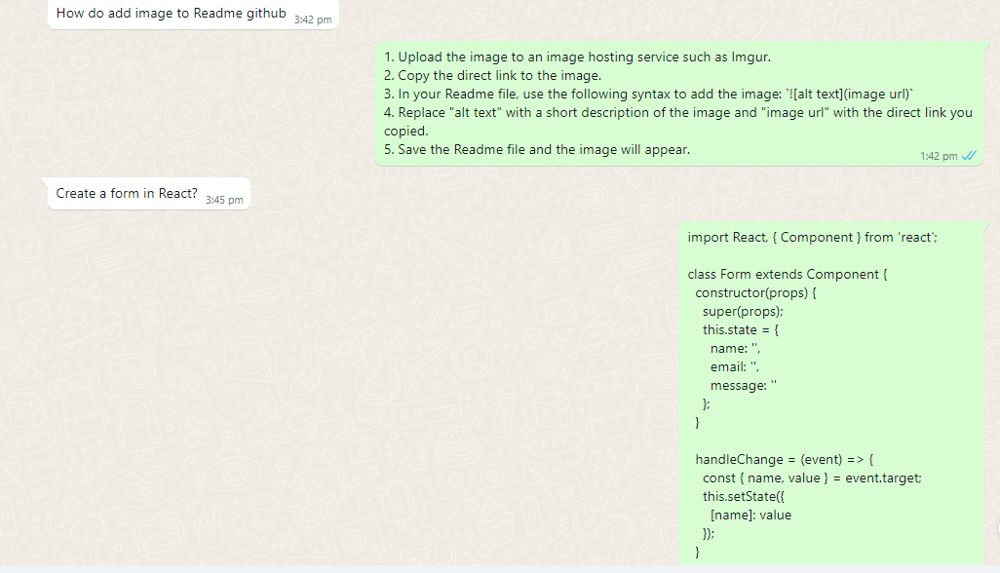

# Whatsapp chat bot that uses open Ai text-completion Api endpoint and whatsapp web js to reply to user queries.

# How to use
 1. clone the project
 2. Navigate to the project's directory.
 3. Run npm install
 4. run npm run dev
 5. scan the qr code.
 6. start chatting with the bot.

This code is using several libraries to build a WhatsApp bot that communicates with OpenAI API.

qrcode-terminal: is used to generate a QR code in the terminal for the user to scan with their WhatsApp application to connect the bot.

whatsapp-web.js: is a JavaScript library for interacting with the WhatsApp Web API. It allows you to interact with the WhatsApp client running in a web browser.

openai: is a JavaScript library for interacting with the OpenAI API.

dotenv: is a zero-dependency module that loads environment variables from a .env file.

This script creates an instance of a Client from whatsapp-web.js and connects to the WhatsApp web API using QR code.
Once the client is connected, the script listens to incoming messages using the client.on('message', callback) method and sends the message body to the OpenAI API using the openai.createCompletion() method with the provided model, prompt and other parameters.
Then it takes the first choice of the response and sends it back to the user via WhatsApp using the client.sendMessage() method.
The script also includes a try-catch block to handle errors and logs them to the console.

It is worth noting that the script uses the environment variable for the OpenAI API key, which is being loaded from the .env file using the dotenv library.
This is how the app works. It responds to every query. 

# If you are faced Cannot read properties of undefined (reading 'queryExists) bug
I changed: (node_modules/whatsapp-web.js/src/util/Injected.js) window.Store.QueryExist = window.mR.findModule('queryExists')[0].queryExists;
to window.Store.QueryExist = window.mR.findModule('queryExists')[0] ? window.mR.findModule('queryExists')[0].queryExists : window.mR.findModule('queryExist')[0].queryWidExists;
